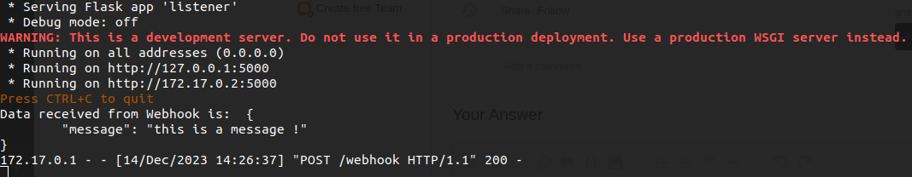

# Docker / Python Webhooks Listener

  

## How to use

Run bash script

```bash
./build.sh
```

This script will : 

- Delete the container pylistener_run if exists
- Build a new image
- Run a container


Make a POST call with Curl, Postman/Insomnia to : http://0.0.0.0:5000

In body field chose Raw with JSON Type and add your JSON data.

## Result

When you launch the script and you make POST call you will see that :

